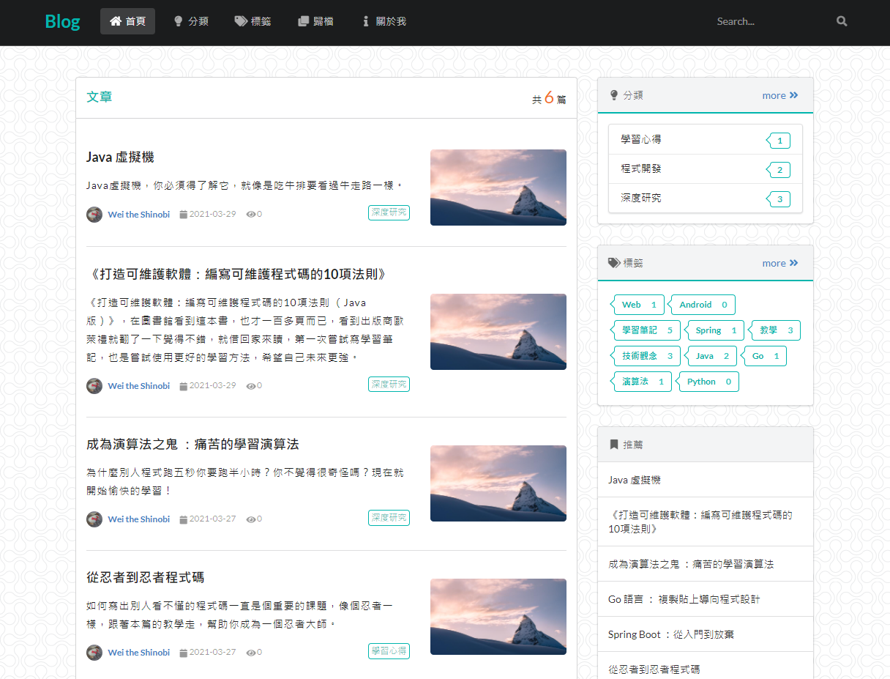
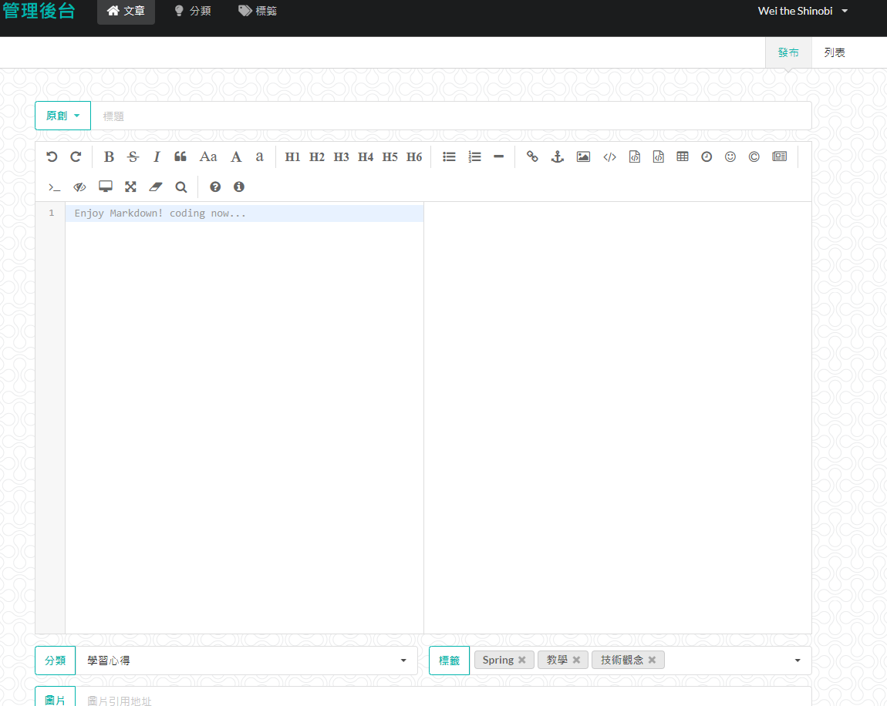

# 美麗ㄉ部落格

# 技術集成

- 後端：Java Spring Boot
- 前端模板：Semantic UI
- 模板引擎：Thymeleaf
- 測試：JUnit5
- 資料庫：MySQL
- 插件：
  - [typo.css](https://github.com/sofish/typo.css) 中文網頁重設與排版
  - [prism](https://github.com/PrismJS/prism) 程式碼顯示優化
  - [Editor.md](https://pandao.github.io/editor.md/index.html) 開源在線 Markdown 編輯器

# 功能

- 後臺管理 (localhost:8080/admin)
  - 登入
    - 使用者：admin；密碼：123456
  - 文章與文章屬性管理
    - 搜尋文章
  - 分類管理
  - 標籤管理
- 前臺
  - 文章搜尋
  - 首頁
    - 文章、分類、標籤、推薦文章
  - 類型分類
  - 標籤分類
  - 歸檔
  - 關於我

# Demo

---

## [Demo影片連結](https://youtu.be/t5pOGZBE6FE)

---

